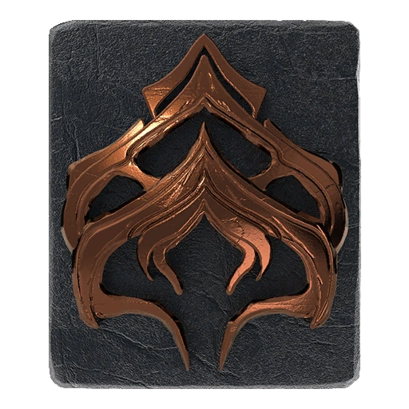

# Warframe Mastery Tracker

[](https://opensource.org/licenses/MIT)
[](https://developer.mozilla.org/en-US/docs/Web/JavaScript)
[]()
[](https://warframestat.us/)

<br>

A lightweight, web-based tool designed to help Tenno track their Mastery Rank progress.

This project fetches data dynamically from the Warframe community API, filters "masterable" items, and calculates user rank in real-time using the official game formulas. It features a responsive, dark-mode interface inspired by _Warframe.market_ and utilizes LocalStorage to save progress without requiring a backend or user account.

<p align="center">
  
</p>

<br>

## 🚀 Key Features

- **Real-time Mastery Calculation:** Automatically calculates your current Rank (e.g., Gold Sage) and remaining XP for the next promotion using the `2500 * rank^2` formula.
- **Dynamic Data Fetching:** Consumes the [WarframeStat.us](https://warframestat.us/) API to ensure item lists are always up to date.
- **Smart Filtering:** \* Automatically excludes non-masterable items (Skins, Resources, Railjack components).
  - Filters Founders exclusives (Excalibur Prime, Skana Prime, Lato Prime).
  - Groups modular items (MOAs, Zaws, Kitguns, Amps) logically.
- **Persistent Progress:** Uses browser `LocalStorage` to save your checked items, nickname, and glyph selection.
- **Visual Feedback:** distinct visual states for "Acquired" (Blue) and "Mastered" (Green/Glow) items.
- **Responsive Design:** Fully styled "Dark Mode" interface compatible with desktop and mobile.

<br>

## 🛠️ Tech Stack

This project was built with a focus on performance and simplicity, using no heavy frameworks.

- **Core:** HTML5, CSS3, Vanilla JavaScript (ES6+).
- **Data Source:** `fetch()` API consuming JSON data.
- **Styling:** Flexbox & CSS Grid for layout.
- **Assets:** Dynamic icon mapping for Mastery Ranks (Initiate to Legendary).

<br>

## 📦 Installation & Usage

Since this is a static web application, you don't need `npm` or `node_modules` to run it locally.

### Prerequisites

- A modern web browser (Chrome, Firefox, Edge).
- **VS Code** with **Live Server** extension (Recommended to avoid CORS issues with local JSON fetching).

### Steps

1.  **Clone the repository:**
    ```bash
    git clone [https://github.com/ArkGrayer/warframe-mastery-tracker.git](https://github.com/ArkGrayer/warframe-mastery-tracker.git)
    ```
2.  **Open the folder:**
    Navigate to the project directory.
3.  **Run the App:**
    - Open `index.html` using "Live Server" in VS Code.
    - _Note: Opening the file directly (file://) might block API requests due to browser security policies._

<br>

## 📂 Project Structure

```text
warframe-mastery-tracker/
├── CSS/
│   └── style.css       # Main stylesheet (Dark theme, layouts)
├── Scripts/
│   └── script.js       # Core logic (API fetch, filters, XP calc)
├── img/
│   ├── ranks/          # Local mastery rank icons (.webp)
│   └── favicon.png     # Site icon
├── index.html          # Main application structure
├── LICENSE             # MIT License
└── README.md           # Documentation
```

<br>

## 🤝 Contributing

Contributions, issues, and feature requests are welcome!
Feel free to check the [issues page](../../issues).

1.  Fork the project.
2.  Create your feature branch (`git checkout -b feature/AmazingFeature`).
3.  Commit your changes (`git commit -m 'Add some AmazingFeature'`).
4.  Push to the branch (`git push origin feature/AmazingFeature`).
5.  Open a Pull Request.

<br>

## 📝 License

Distributed under the MIT License. See `LICENSE` for more information.

<br>

## ⚖️ Legal Disclaimer

**Disclaimer:**
Digital Extremes Ltd, Warframe and the logo Warframe are registered trademarks. All rights are reserved worldwide. This site has no official link with Digital Extremes Ltd or Warframe. All artwork, screenshots, characters or other recognizable features of the intellectual property relating to these trademarks are likewise the intellectual property of Digital Extremes Ltd.
